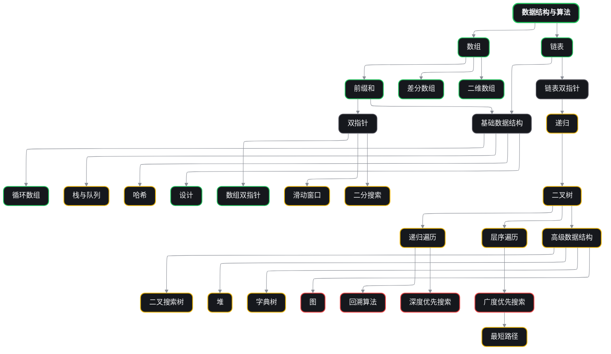
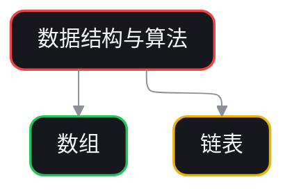

## Roadmap demo

This page shows a minimal usable version of a roadmap-style knowledge map. It uses a styled Mermaid `flowchart`, so you can keep the roadmap in plain MDX without adding a custom frontend app.



## Why this works as an MVP

- Keeps the roadmap in one MDX file
- Gives you explicit node hierarchy and status color
- Stays easy to edit without adding a custom frontend stack
- Works inside Mintlify with no extra build setup

## Usage

````mdx

````

## Next step

If you need clickable cards, a right-side detail panel, or per-node exercise progress, Mermaid will stop being enough. At that point, move to a custom React page with React Flow.
