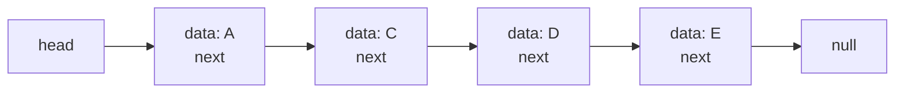

## 关于链表，你该了解这些

链表是一种通过指针串联起来的线性结构。

每个节点通常包含两部分：

- 数据域，用来存储当前节点的值
- 指针域，用来指向下一个节点

链表的入口节点一般称为头节点，也就是 `head`。和数组不同，链表并不依赖连续内存，而是通过指针把分散的节点连接起来。

<Note>
链表这一章最重要的不是背题，而是先建立一个稳定的判断：链表题的本质通常是在改指针，而不是在改值。
</Note>

## 链表的类型

在刷题里，最常见的链表主要有三种。

### 单链表

单链表的每个节点只保存一个 `next` 指针，用来指向下一个节点。

这是 LeetCode 里最常见的链表模型，大多数基础题默认都是单链表。

```python
class ListNode:
    def __init__(self, val: int = 0, next: "ListNode | None" = None):
        self.val = val
        self.next = next
```

### 双链表

双链表中的每个节点会保存两个方向的信息：

- 指向前一个节点
- 指向后一个节点

这样做的好处是既可以向后走，也可以向前走，但节点定义会更复杂一些。

```python
class DoubleListNode:
    def __init__(
        self,
        val: int = 0,
        prev: "DoubleListNode | None" = None,
        next: "DoubleListNode | None" = None,
    ):
        self.val = val
        self.prev = prev
        self.next = next
```

### 循环链表

循环链表的特点是尾节点不会指向 `None`，而是重新指回头节点。

这种结构经常出现在环形问题里，例如判断链表是否有环。

## 链表的存储方式

理解链表，最关键的一步就是把它和数组分开看。

数组在内存中通常是连续存储的，所以可以通过下标快速访问任意位置。

链表则不同。链表中的节点通常分散在内存的不同位置，节点之间靠指针连接。也正因为如此：

- 链表查询某个位置通常比较慢
- 链表在局部插入和删除时通常更灵活

所以你可以先记住一句话：

- 数组更适合查
- 链表更适合改

<Tip>
如果一道题频繁要求你在头部、中间做插入和删除，而且不强调随机访问，那么你就应该优先想到链表。
</Tip>

## 链表的定义

很多人刷题时觉得链表不难，但一到手写节点定义就容易出错。

原因很简单：LeetCode 已经帮你把节点定义好了，你平时只是在“使用链表”，没有真正“定义链表”。

对于单链表来说，最基础的定义就是：

```python
class ListNode:
    def __init__(self, val: int = 0, next: "ListNode | None" = None):
        self.val = val
        self.next = next
```

这段定义里，最重要的不是语法本身，而是你要真正建立下面这个意识：

- 每个节点只知道自己是谁
- 每个节点只知道自己的下一个节点是谁

链表不是靠“位置”连接，而是靠“引用”连接。

下面这张图可以把单链表的结构直观地串起来：



如果你把每个节点看成“数据域 + 指针域”，那整条链表其实就是通过 `next` 一个一个连起来的。

## 链表的操作

### 删除节点

链表删除节点的关键不是删除动作本身，而是改指针。

如果你已经拿到了待删除节点的前一个节点，那么删除当前节点只需要把前一个节点的 `next` 指向后一个节点。

```python
class ListNode:
    def __init__(self, val: int = 0, next: "ListNode | None" = None):
        self.val = val
        self.next = next


def remove_elements(head: ListNode | None, target: int) -> ListNode | None:
    dummy = ListNode(0, head)
    prev = dummy
    cur = head

    while cur:
        if cur.val == target:
            prev.next = cur.next
        else:
            prev = cur
        cur = cur.next

    return dummy.next
```

这里用到 `dummy node` 的原因很典型：头节点也可能被删，所以先把头节点变成普通情况，代码会更稳。

<Warning>
链表删除最容易犯的错不是逻辑不懂，而是指针顺序写错。只要你提前把连接关系改坏，后面的节点就可能直接丢失。
</Warning>

### 添加节点

链表添加节点的核心同样是改指针。

如果你已经知道插入位置前一个节点是谁，那么插入一个新节点通常只需要常数次操作。

```python
class ListNode:
    def __init__(self, val: int = 0, next: "ListNode | None" = None):
        self.val = val
        self.next = next


def insert_after(prev: ListNode, val: int) -> None:
    new_node = ListNode(val)
    new_node.next = prev.next
    prev.next = new_node
```

所以链表的增删往往不难，真正的难点通常在于：

- 你能不能找到正确的前驱节点

### 查询节点

链表不像数组那样能通过下标直接定位到第 `k` 个元素。

如果你想找到某个位置的节点，通常只能从头节点开始一个一个往后走。

```python
def get_kth_node(head: ListNode | None, k: int) -> ListNode | None:
    cur = head
    step = 0

    while cur and step < k:
        cur = cur.next
        step += 1

    return cur
```

这也是为什么链表在查询类问题上通常不如数组。

## 性能分析

链表和数组放在一起看，会更容易理解它们的适用场景。

- 数组随机访问通常是 `O(1)`
- 链表随机访问通常是 `O(n)`
- 链表在已知前驱节点时，插入和删除通常是 `O(1)`

所以链表更适合：

- 数据量不固定
- 增删频繁
- 查询相对较少

而数组更适合：

- 高频查询
- 按下标处理问题

## 链表题为什么总绕不开快慢指针

链表题里有一类非常高频的技巧叫快慢指针。

它通常用来解决：

- 找中点
- 找倒数第 `k` 个节点
- 判断是否有环
- 找环入口

```python
def has_cycle(head: ListNode | None) -> bool:
    slow = head
    fast = head

    while fast and fast.next:
        slow = slow.next
        fast = fast.next.next
        if slow == fast:
            return True

    return False
```

这类题的关键在于：链表无法随机访问，所以很多“位置信息”都需要通过指针速度差来制造。

## 一道链表题通常怎么想

写链表题之前，先不要急着写代码，先把下面四个问题在脑子里过一遍：

1. 这题要改哪个节点的 `next`？
2. 我需不需要前驱节点？
3. 头节点会不会被修改？
4. 这题是不是快慢指针模型？

很多链表题一旦把这四个问题想清楚，代码基本就顺了。

## 学习建议

如果你刚开始刷链表题，建议按这个顺序练：

- 移除链表元素
- 设计链表
- 反转链表
- 两两交换链表中的节点
- 删除链表的倒数第 `N` 个节点
- 环形链表

链表这一章真正要练出来的，不是记住几个题，而是形成一个稳定的直觉：

- 看到链表题，先想清楚节点关系
- 先判断需不需要虚拟头节点
- 先判断需不需要前驱节点
- 先判断能不能用快慢指针
