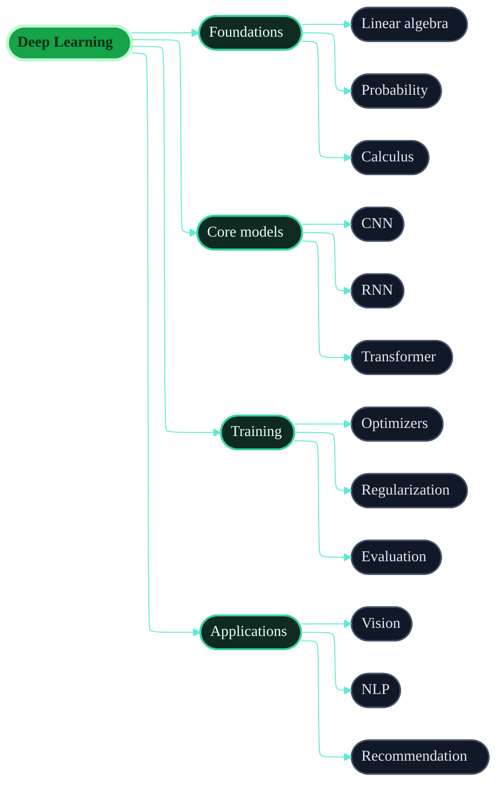
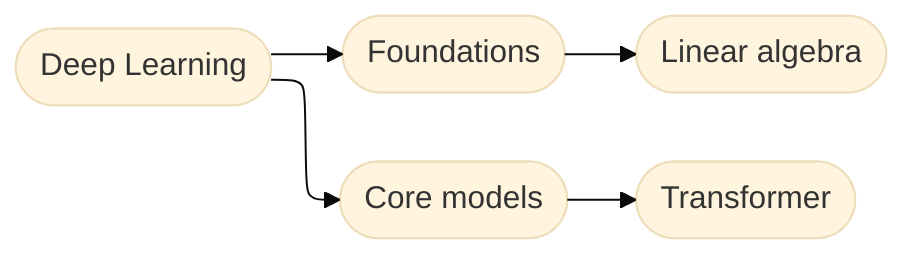

## Mind map demo

This version keeps the Mermaid workflow, but uses a styled `flowchart` instead of the default `mindmap` layout. That gives you better control over spacing, color, and visual hierarchy while staying lightweight.



## Why this looks better

- Uses a stronger visual hierarchy than Mermaid's default `mindmap`
- Matches the dark green tone of the current site
- Removes the extra floating controls for a cleaner embedded look
- Keeps the source fully text-based and easy to maintain

## Usage

````mdx

````

## Practical limit

This is close to the visual ceiling of Mermaid inside a docs page. If you need custom node cards, richer branding, or interaction beyond static zoom and pan, Mermaid stops being the right tool and you should move to a real client-side component.
