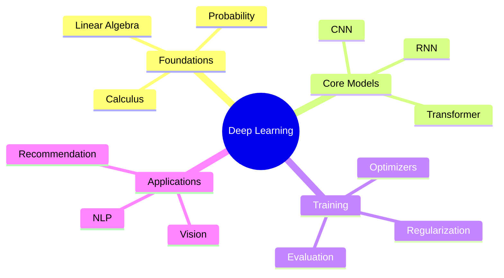
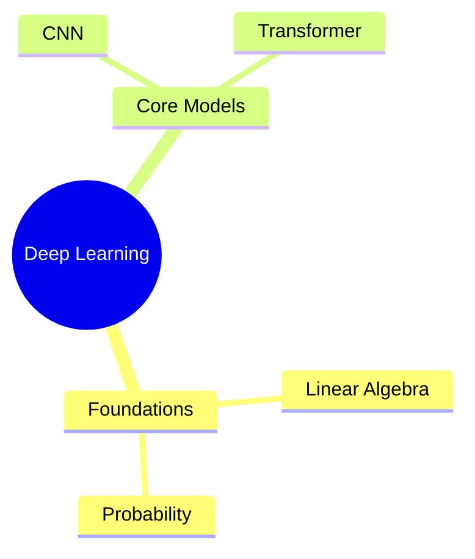

## Mind map demo

Use a Mermaid `mindmap` block when you want the lightest possible way to embed a knowledge map in a page.



## Why this is the minimum viable approach

- No extra npm packages
- No custom React component
- Easy to maintain because the content stays as text
- Works well for static concept maps in docs or blog posts

## Usage

````mdx

````

## When to upgrade from this

Move beyond Mermaid if you need:

- custom node design
- click interactions
- expand or collapse behavior
- richer layout control
